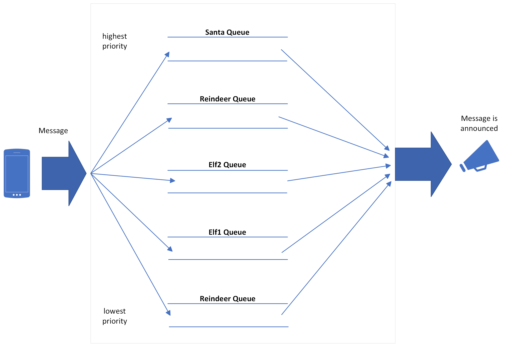

## Assignment 3: JingleNet

> JingleNet has sprinkled a touch of magic into our communication at the North
> Pole, making it as smooth as freshly fallen snow. -- Santa Claus

At the North Pole, Santa and his elves use the **JingleNet announcement system**
to to play announcements over the North Pole loud speakers for all to hear.

Your task is to write a program named [a3.cpp](a3.cpp) that processes a sequence
of JingleNet commands, and outputs the resulting announcements in the proper
order.

For example, here is are the JingleNet commands in
[jinglenet_input1.txt](jinglenet_input1.txt):

```
SEND greenie elf2 send candy canes
ANNOUNCE 1
SEND yumyum elf2 I love candy canes!
ANNOUNCE 2
```

`SEND` puts an announcement into the JingleNet queue system, and `ANNOUNCE n`
prints the next `n` announcements to `announcements.txt`. To run the program on
this input you would type:

```
> ./a3 jinglenet_input1.txt
2 announcements written to announcements.txt
```

And the contents of `announcements.txt` is:

```
1: {greenie, elf2, "send candy canes"}
2: {yumyum, elf2, "I love candy canes!"}
```

The details of all the commands and how they work are given below.


## JingleNet Architecture

The JingleNet system is essentially a large queue consisting of 5 internal
queues:



When an announcement is added to JingleNet it is placed in the queue for its
**rank**. Every announcement has one of these 5 ranks:

- **santa**: the highest rank
- **reindeer**: the second highest rank
- **elf2**: the third highest rank
- **elf1**: the fourth highest rank
- **snowman**: the lowest rank

Ranks are per-announcement. There could be announcements from the same user in
different queues at the same time.

Here's a textual representation of the queues when they are empty:

```
(left is front of queue, right is back of queue)
   santa: []
reindeer: []
    elf2: []
    elf1: []
 snowman: []
```

And here's what they look like with a total of 5 announcements in the system:

```
(left is front of queue, right is back of queue)
   santa: [{yumyum, santa, "I love Christmas!"}, {lili, santa, "Hi!!"}]
reindeer: [{yumyum, reindeer, "mmm, peppermint"}]
    elf2: []
    elf1: []
 snowman: [{choco, snowman, "choco4ever"}, {yumyum, snowman, "I'm hungry!"}]
```

As noted, the left-most item is at the *front* of each queue, and the right-most
item is at the *back*. So items are enqueued at the right end and de-queued at
the left.

## JingleNet Commands

JingleNet is controlled by these 4 commands:

- **SEND** *username* *rank* *message*: *username* sends an announcement of rank
  *rank* with text *message*
- **REMOVE_ALL** *username*: all announcements from *username* are removed from
  the JingleNet system
- **PROMOTE_ANNOUNCEMENTS** *username*: all announcements from *username* are
  moved to the next highest rank
- **ANNOUNCE** *n*: the next *n* announcements are printed to
  `announcements.txt`

The `Announcement` class is in [Announcement.h](Announcement.h). `Announcement`
objects are *immutable*, i.e. once created they cannot be changed. Here are
three different ways to create the same announcement (see
[announcement_demo.cpp](announcement_demo.cpp)):

```c++
Announcement a1("yumyum", Rank::SANTA, "I love Christmas!");
cout << a1 << endl; // prints: {yumyum, santa, "I love Christmas!"}

// copy another Announcement
Announcement a2(a1);
cout << a2 << endl; // prints: {yumyum, santa, "I love Christmas!"}

// parse a string of the form "sender_name rank text"
Announcement a3("yumyum santa I love Christmas!");
cout << a3 << endl; // prints: {yumyum, santa, "I love Christmas!"}
```

### Sending Announcements

**SEND** *username* *rank* *message*

This adds an announcement from *username* of rank *rank* with text *message* to
the JingleNet system.

For example, suppose the JingleNet queues look like this:

```
(left is front of queue, right is back of queue)
   santa: [{yumyum, santa, "I love Christmas!"}, {lili, santa, "Hi!!"}]
reindeer: [{yumyum, reindeer, "mmm, peppermint"}]
    elf2: []
    elf1: []
 snowman: [{choco, snowman, "choco4ever"}, {yumyum, snowman, "I'm hungry!"}]
```

Then after this command:

```
SEND yumyum Snowman yaaay!
```

The queues look like this:

```
(left is front of queue, right is back of queue)
   santa: [{yumyum, santa, "I love Christmas!"}, {lili, santa, "Hi!!"}]
reindeer: [{yumyum, reindeer, "mmm, peppermint"}]
    elf2: []
    elf1: []
 snowman: [{choco, snowman, "choco4ever"}, {yumyum, snowman, "I'm hungry!"}, 
           {yumyum, snowman, "yaaay!"}]
```

### Removing Announcements

**REMOVE_ALL** *username*

This removes all announcements from *username*, whatever queue(s) they are in.
If there are no announcements from *username*, then nothing happens.

For example, suppose the JingleNet queues look like this:

```
(left is front of queue, right is back of queue)
   santa: [{lili, santa, "Hi!!"}, {yumyum, santa, "I love Christmas!"}]
reindeer: []
    elf2: []
    elf1: []
 snowman: [{yumyum, snowman, "yaaay!"}]
```

Then after this command:

```
REMOVE_ALL yumyum
```

The queues look like this:

```
(left is front of queue, right is back of queue)
   santa: [{lili, santa, "Hi!!"}]
reindeer: []
    elf2: []
    elf1: []
 snowman: []
```

### Promoting Announcements

**PROMOTE_ANNOUNCEMENTS** *username*

This moves all announcements from *username* to the next highest queue.
Announcements are dequeued from their current queue and then enqueued in the
queue one rank higher. Nothing happens to announcements in the **santa** queue:
they are already at the highest rank.

When promoting announcements, start with **reindeer** queue and work downwards.
First any announcements in the **reindeer** are promoted to the **santa** queue,
and then any announcements in the **elf2** queue are promoted to the
**reindeer** queue, and so on.

When items are put into another queue, they are enqueued at the back in the
usual way. If multiple announcements are promoted from a queue, then they are
enqueued so they appear in the same order as in the queue they were promoted
from.

For example, suppose the queues look like this:

```
(left is front of queue, right is back of queue)
   santa: [{lili, santa, "Hi!!"}, {yumyum, santa, "I love Christmas!"}]
reindeer: [{yumyum, reindeer, "Rocking horse repair needed!"}, 
           {rudolph, reindeer, "I'm hungry!"}]
    elf2: []
    elf1: []
 snowman: [{yumyum, snowman, "yaaay!"}, {choco, snowman, "choco4ever"}, 
           {yumyum, snowman, "I'm hungry"}]
```

Then after the command:

```
PROMOTE_ANNOUNCEMENTS yumyum
```

The queues look like this:

```
(left is front of queue, right is back of queue)
   santa: [{lili, santa, "Hi!!"}, {yumyum, santa, "I love Christmas!"}, 
           {yumyum, santa, "Rocking horse repair needed!"}]
reindeer: [{rudolph, reindeer, "I'm hungry!"}]
    elf2: []
    elf1: [{yumyum, elf1, "yaaay!"}, {yumyum, elf1, "I'm hungry"}]
 snowman: [{choco, snowman, "choco4ever"}]
```

### Announcing Announcements

**ANNOUNCE** *n*

De-queues and announces the next *n* announcements from the queues in this
order:

- All announcements in the **santa** queue, in the order they were enqueued.
- Then all announcements in the **reindeer** queue, in the order they were
  enqueued.
- Then all announcements in the **elf2** queue, in the order they were enqueued.
- Then all announcements in the **elf1** queue, in the order they were enqueued.
- Then all announcements in the **snowman** queue, in the order they were
  enqueued.

If there are fewer then *n* announcements in the queues, then all announcements
are removed (in the proper order). You can assume that *n* is always a positive
integer.

To announce a announcement, use `jnet.announce` from
[JingleNet_announcer.h](JingleNet_announcer.h):

```
jnet.announce(a);  // a is an Announcement
```

The announcements are automatically printed to the file `announcements.txt` when
the program ends. To use `jnet.announce` all you need to do is #include
[JingleNet_announcer.h](JingleNet_announcer.h) in your program.

> **Be careful!** `announcements.txt` gets over-written at the end of every
> program that uses [JingleNet_announcer.h](JingleNet_announcer.h).

Please be sure to announce announcements in this exact way using
`jnet.announce`.

Here's an example of how announcing works. Suppose the queues look like this:

```
(left is front of queue, right is back of queue)
   santa: [{lili, santa, "Hi!!"}, {yumyum, santa, "I love Christmas!"}]
reindeer: [{yumyum, reindeer, "Rocking horse repair needed!"}, 
           {yumyum, reindeer, "I'm hungry!"}]
    elf1: [{yumyum, elf1, "yaaay!"}, {yumyum, elf1, "I'm hungry"}]
    elf2: []
 snowman: [{choco, snowman, "choco4ever"}]
```

Then after this command:

```
ANNOUNCE 3
```

This removes the next 3 announcements from the queues. The queues then look like
this:

```
(left is front of queue, right is back of queue)
   santa: []
reindeer: [{yumyum, reindeer, "I'm hungry!"}]
    elf1: [{yumyum, elf1, "yaaay!"}, {yumyum, elf1, "I'm hungry"}]
    elf2: []
 snowman: [{choco, snowman, "choco4ever"}]
```

When the program ends, `announcements.txt` looks like this (assuming no other
announcements were made):

```
1: {lili, santa, "Hi!!"}
2: {yumyum, santa, "I love Christmas!"}
3: {yumyum, reindeer, "Rocking horse repair needed!"}
```

## Special Requirements

- Put all your code for this assignment into a single file called
  [a3.cpp](a3.cpp). It should have a `main` function that reads the name of a
  file and processes it like this:

  ```
  > ./a3 input1.txt
  ...
  ```

  See [getline_demo.cpp](getline_demo.cpp) for an example of reading
  command-line arguments and processing a file line-by-line.

- Inside [a3.cpp](a3.cpp), implement your own queue class called `Queue` that
  inherits from [Queue_base.h](Queue_base.h). Also:
  - Your `Queue` does *not* need to be a template class, e.g. it can inherit
    from `Queue_base<Announcement>`.
  - For this assignment, you must implement your `Queue` using either a
    singly-linked or doubly-linked list that you code yourself. Do **not** use
    arrays, vectors, or other containers to implement `Queue`.
  - Make sure that all methods meet the performance requirements listed in
    [Queue_base.h](Queue_base.h).

- Implement a class called `JingleNet` that stores the 5 queues. The details of
  this class is up to you. Use it in a sensible way that makes your program
  easier to understand. For instance, `JingleNet` could have a method for each
  JingleNet command above.

## Sample Runs

Here are a few sample input files and their corresponding output files:

- [jinglenet_input1.txt](jinglenet_input1.txt), [output1.txt](output1.txt)
- [jinglenet_input2.txt](jinglenet_input2.txt), [output2.txt](output2.txt)
- [jinglenet_input3.txt](jinglenet_input3.txt), [output3.txt](output3.txt)
- [jinglenet_input4.txt](jinglenet_input4.txt), [output4.txt](output4.txt)
- [jinglenet_input5.txt](jinglenet_input5.txt), [output5.txt](output5.txt)

You can run them like this:

```
❯ ./a3 jinglenet_input1.txt
2 announcements written to announcements.txt

❯ cat announcements.txt
1: {greenie, elf2, "send candy canes"}
2: {yumyum, elf2, "I love candy canes!"}
```

The `diff` command is useful for comparing files:

```
❯ ./a3 jinglenet_input1.txt
2 announcements written to announcements.txt

> diff announcements.txt output1.txt

```

`diff` only prints differences between the files, so no output means the files
are the same.


## What to Submit

When you're done, submit your finished [a3.cpp](a3.cpp) file on Canvas. Don't
submit anything else. 

## Grading

The marker will compile and run your program on Ubuntu Linux using
[makefile](makefile) like this:

```bash
> make a3
g++ -std=c++17 -Wall -Wextra -Werror -Wfatal-errors -Wno-sign-compare -Wnon-virtual-dtor -g a3.cpp -o a3

> valgrind ./a3 some_input_file.txt
... testing output ...
```

## Marking Scheme

### The Queue Class: 10 marks

- **1 mark**: [a3.cpp](a3.cpp) contains a class named `Queue` that inherits from
  [Queue_base.h](Queue_base.h).
- **4 marks**: All the methods in `Queue` listed in [Queue_base.h](Queue_base.h)
  work correctly.
- **2 marks**: All the methods in `Queue` meet the performance requirements
  listed in [Queue_base.h](Queue_base.h).
- **3 marks**: The `Queue` class is implemented using either a singly-linked or
  doubly-linked list. that you coded yourself. Do **not** use arrays, vectors,
  or other containers to implement `Queue`.

### The JingleNet Class: 4 marks

- **2 marks**: [a3.cpp](a3.cpp) contains a class named `JingleNet` that stores
  the 5 queues.
- **2 marks**: The `JingleNet` class is used in a sensible way that makes your
  program easier to understand.

### Correctness: 13 marks

- **5 marks**: valgrind reports no memory leaks or other errors when the program
  runs.
- **5 marks**: The program produces the correct output for
  [jinglenet_input1.txt](jinglenet_input1.txt),
  [jinglenet_input2.txt](jinglenet_input2.txt),
  [jinglenet_input3.txt](jinglenet_input3.txt),
  [jinglenet_input4.txt](jinglenet_input4.txt), and
  [jinglenet_input5.txt](jinglenet_input5.txt).
- **3 marks**: The program produces the correct output for another input file,
  in the same style as the `jinglenet_input` files supplied by the markers.


### Overall source code readability: 5 marks

- All code is sensibly and consistently indented, and all lines are 100
  characters in length, or less.
- Whitespace is used to group related pieces of a code to make it easier for
  humans to read. All whitespace has a purpose.
- Variable and function names are self-descriptive.
- Appropriate features of C++ are used, as discussed in class and in the notes.
  **Note** If you use a feature that we haven't discussed in class, **you must
  explain it in a comment**, even if you think it's obvious.
- Comments are used when needed to explain code whose purpose is not obvious
  from the code itself. There should be *no* commented-out code from previous
  versions.

### Deductions

- Up to **-3 marks** if you do *not* include your full name, email, and SFU ID
  in the header of your file.
- Up to **-3 marks** if your submitted files don't following the
  naming/formatting conventions given above.
- **A score of 0** if: 
  - your code *doesn't* compile with the given makefile
  - valgrind reports any memory leaks, or other errors
  - you *don't* include the "Statement of Originality", or it is modified in any
    way
  - use code from some other source (e.g. the web, the textbook, ChatGPT, ...)
    *without* citing its source.
  - submit a "wrong" non-working file, and then *after the due date* submit the
    "right" file. If you can provide evidence that you finished the assignment
    on time, then it may be marked.

There may be other deductions, depending upon the circumstances.
