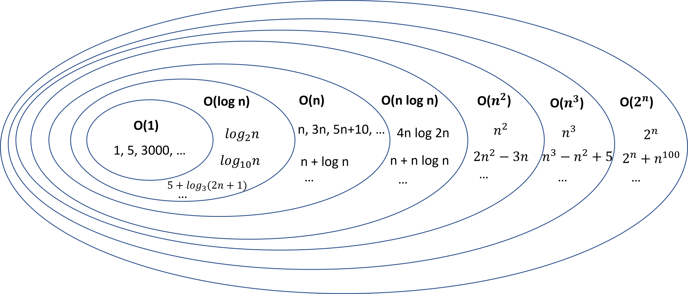

 - [singly_linked_list3.cpp](singly_linked_list3.cpp) shows how to implement
   some more methods for the `List` class, such as `contains(s)` and
   `reverse()`.
   [singly_linked_list3_recursive.cpp](singly_linked_list3_recursive.cpp) shows
   to recursion in place of loops to implement many of the methods.

- [Notes on O-notation and algorithm analysis](analysis.md). This is based on
  sections 4.1 and 4.2 of the textbook.

- This diagram shows the difference between best case, average case, and worst
  case performance of an algorithm:

  

- This diagram shows how different O-notation expressions are subsets of other
  ones:

  
