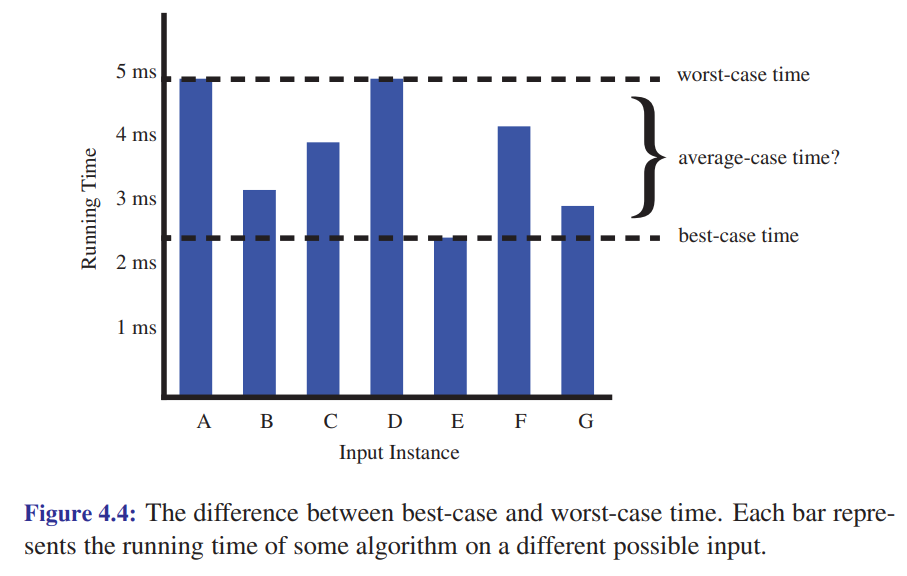

# Analysis Tools (Chapter 4)

When studying the running-time and memory usage of algorithms, we will focus on
algorithms that take $n$ values as input, and then perform some carefully chosen
**key operation** $f(n)$ amount of work.

For example, the **quicksort** sorting algorithm takes an array of $n$ numbers
as input, and then does about $f(n) = n \log n$ *comparisons to put the values
in sorted order. Comparisons are the traditional key operation of work for
sorting algorithms.

In this course, we'll mainly see the following seven functions when studying
algorithm running time ....

## The Constant Function

A **constant function** has this general form: $f(n) = c$. Importantly, the
value of $c$ is fixed, and does *not* depend on $n$.

e.g. $f(n) = 5$

e.g. $f(n) = 2^{100}$

e.g. Suppose $f(n)$ and $g(n)$ are both constant functions. Then these are
also constant functions:

- $h_1(n) = f(n) + g(n)$
- $h_2(n) = f(n) - g(n)$
- $h_3(n) = f(n) * g(n)$
- $h_4(n) = f(n) / g(n)$ (assuming $g(n) \neq 0$)
- $h_5(n) = f(n)^{g(n)}$
- $h_6(n) = f(g(n))$

## The Logarithm Function

The **logarithm function** is $f(n) = \log_b n$, where $b$ is a fixed constant
called the **base** of the logarithm. We also assume $b > 1$. It is the
*inverse* of the exponential function, i.e. $x = \log_b n$ if and only if 
$b^x = n$.

In computer science, if we don't write the base for a logarithm, we assume it is
2, i.e. $\log n = \log_2 n$.

> **Careful!** Mathematics usually assumes logarithms are to the base $e$, i.e.
> in math $\log n = \log_e n = \ln n$. We use 2 because it is more common than
> $e$ in computer science.

Proposition 4.1 lists the rules you should know about logarithms. Given real
numbers $a > 0$, $b > 1$, $c > 0$, and $d > 1$:

1. $\log_b ac = \log_b a + \log_b c$
2. $\log_b \frac{a}{c} = \log_b a - \log_b c$
3. $\log_b a^c = c \log_b a$
4. $\log_b a = \frac{\log_d a}{\log_d b}$
5. $b^{\log_d a} = a^{\log_d a}$

**Fact** If $n$ is a non-negative base 10 integer, then $\lceil log_b n \rceil$
is the number of *bits* needed to represent it as a regular binary number. For
example, the base 10 number 250 needs 8 bits to represent it as a binary number,
and $\lceil \log_2 250 \rceil = \lceil 7.97 \rceil = 8$.

Similarly, $\lceil \log_{10} n \rceil$ is the number of base *digits* needed to
represent $n$. For example, the number $2^{100}$ has 31 digits, and 
$\lceil \log_{10} 2^{100} \rceil = \lceil 30.1 \rceil = 31$.

The expression $\lceil x \rceil$ is the **ceiling** of $x$, i.e. the smallest
integer greater than or equal to $x$. The expression $\lfloor x \rfloor$ is the
**floor** of $x$, i.e. the largest integer less than or equal to $x$.

## The Linear Function

The basic **linear function** is $f(n) = n$, i.e. given $n$ it returns $n$. More
generally, if $a$ and $b$ are fixed constants, then $f(n) = an + b$ is also a
linear function.

e.g. If $f(n)$ and $g(n)$ are both linear functions, then these are also linear
functions:

- $h_1(n) = f(n) + g(n)$
- $h_2(n) = f(n) - g(n)$

To prove that $h_1$ is linear, suppose $f(n) = an + b$ and $g(n) = cn + d$. Then
$h_1(n) = f(n) + g(n) = (an + b) + (cn + d) = (a + c)n + (b + d)$, which is
linear because $a + c$ and $b + d$ are fixed constants.

## The N-Log-N Function

The function $f(n) = n \log n$ is called the **n-log-n function**, and arises in
a number of important places in computer science. For instance, for any
comparison-based sorting algorithm (such as mergesort or quicksort) there are
always some inputs that need at least $n \log n$ comparisons to sort.

## The Quadratic Function

$f(n) = n^2$ is the basic **quadratic function**. In programming, we often see
it in nested loops, e.g.

```
count = 0
for i = 1 to n
    for j = 1 to n
        count = count + 1
```

`count` has the value $n^2$ at the end of this code. Intuitively, the outer loop
executes $n$ times, and the inner loop executes $n$ times for each iteration of
the outer loop, and so the total number of executions of the inner loop is 
$n \cdot n = n^2$.

A useful fact to remember is that the sum of the numbers from 1 to $n$ is a
quadratic function:

$$
1 + 2 + 3 + \ldots + n = \frac{n(n+1)}{2}
$$

$\frac{n(n+1)}{2}$ can be re-written $\frac{1}{2}n^2 + \frac{1}{2}n$.


## The Cubic Function and Other Polynomials

The **cube function** is $f(n) = n^3$. The cubic, quadratic, linear, and
constant functions are all examples of **polynomial** functions, i.e. functions
of the form $f(n) = a_k n^k + a_{k-1} n^{k-1} + \ldots + a_1 n + a_0$, where $k$
is a non-negative integer and coefficients $a_0, a_1, \ldots, a_k$ are fixed
constants that *don't* depend on $n$.

We will sometimes use **$\Sigma$-notation** to write sums. For example, the sum
of the numbers from 1 to $n$ can be written as:

$$
1 + 2 + 3 + \ldots + n = \sum_{i=1}^n i = \frac{n(n+1)}{2}
$$

A polynomial can be written like this:

$$
a_k n^k + a_{k-1} n^{k-1} + \ldots + a_1 n + a_0 = \sum_{i=0}^k a_i n^i
$$

## The Exponential Function

When $b$ is a positive constant, the **exponential function** is $f(n) = b^n$.
$b$ is called the **base**, and $n$ is the **exponent**. In algorithm analysis
the most common base is 2, and so we usually see $f(n) = 2^n$.

Here are some rules for exponents (Proposition 4.4):

1. $(b^a)^c = b^{ac}$
2. $b^a b^c = b^{a+c}$
3. $b^a / b^c = b^{a-c}$


## Comparing Growth Rates

When you graph the functions above, you can see that they grow at different
rates, i.e. some of the functions are steeper than others. The rates of growth
are ordered from fastest to slowest like this:

- constant, e.g. $f(n) = 50$
- logarithm, e.g. $f(n) = 3\log 2n + 5$
- linear, e.g. $f(n) = 20n + 5$
- n-log-n, e.g. $f(n) = 5n \log n - 10$
- quadratic, e.g. $f(n) = 3n^2 + 2n + 25$
- cubic, e.g. $f(n) = 2n^3 + 5n^2 + 3n + 1$
- exponential, e.g. $f(n) = 2^n + 3$

When we analyze the performance of an algorithm in this course, we will usually
be putting the algorithm into one of the seven categories above. Generally, when
$n$ is big, the constant functions are the fastest, and the exponential
functions are the slowest.

## Algorithm Analysis

A **data structure** is a systematic way of organizing data. For example,
arrays, strings, and linked-lists are examples of data structures. An
**algorithm** is a step-by-step procedure for performing some task in a finite
amount of time. Algorithms and data structures work together. Data structures
and algorithms usually work together: the data structure you use often
determines the algorithm you use, and vice versa.

We will usually be interested in the **running time** of an algorithm, i.e. how
fast it is. We do this by counting how many times some **key operation** the
algorithm executes. 

Sometimes we will also be interested in the **memory usage** of an
algorithm.

### Empirical Analysis of Algorithms

One way to determine an algorithm's running time is to implement it and perform
experiments. This is called **empirical analysis**. While this can be quite
useful, it has some drawbacks:

- experiments can only be done on a relatively small set of inputs, limited by
  the time and memory available on your computer
- when comparing algorithms, it can be hard to be sure that the experimental
  conditions are the same, e.g. different computers run at different speeds
- the algorithm has to be implemented and debugged, which can be time-consuming

In this course, we will introduce the **analytic analysis** of algorithms, which
involves a mathematical examination of an algorithms pseudocode. In many cases,
this can give us useful results more quickly than empirical analysis.

### Primitive Operations (or Key Operations/Instructions)

Above we said an algorithm is a step-by-step procedure for performing some task.
So what is a *step*? This depends on your algorithm and application. We want to
choose steps that make sense for the problem, and that are simple enough to
analyze mathematically. 

We'll call the step we choose for analyzing an algorithm the **primitive
operation**, or **key operation** (or **key instruction**), or **barometer
instruction**.

For example:

- For **summing a list of numbers**, `+` is a good key operation, or calls to
  `[]` (indexing).
- For **printing the values of a linked list**, `print` (or `cout`, C++) is a
  good key operation.
- For **finding the maximum number in a list**, `>` is a good key operation
  because you need to do at least one comparison for each number in the list.
- For **sorting a list of numbers**, `<=` (comparison) is a key operation step,
  because the number of comparisons is often proportional to the running time of
  the algorithm.
- For **multiplying two matrices of numbers**, `*` is a good key operation.

The choice of key operation for an algorithm can have a big difference on its
performance, and so it is important to choose carefully. 

### Best, Average, and Worst Cases

Many algorithms have different running times for different inputs of the same
size. The figure on page 165 of the textbook shows a graph of different running
times.



So there are at least three general cases to consider:

- the **best case**, i.e. what is *least* number of key operations can do for an
  input of size $n$?
- the **worst case**, i.e. what is *greatest* number of key operations can do
  for an input of size $n$?
- the **average case**, i.e. what is *average* number of key operations can do
  for an input of size $n$?

In practice, the *best case* is great when it happens, but we should *not* count
on it. The *average case* is more useful, since the it occurs most frequently.
However, it can be difficult to analyze the average case mathematically since it
usually requires making assumptions about the probabilities of different inputs. 

So, in this course, we will usually focus on the *worst case*, i.e. the most
number of key operations that could possibly be done for an input of size $n$.
Often, the mathematics is simpler for the worst case than for the average case,
and the results can still be useful.

### Asymptotic Notation: O-notation

Computer scientists traditionally use **asymptotic notation** to help describe
the running times of algorithms. We will define it precisely, and then see how
to apply it.

**Definition of O-notation**. Let $f(n)$ and $g(n)$ be functions that map
non-negative integers to real numbers. We assume they return the number of key
operations an algorithm does for an input of size $n$.

$f(n)$ is **big-O** of $g(n)$ if there is a real constant $c > 0$ and an integer
constant $n_0 \geq 1$ such that

$$
f(n) \leq c g(n), \text{ for all } n \geq n_0
$$

Intuitively, this is a way to say that one function is, in a sense, less than or
equal to some other function. When we say $f(n)$ is $O(g(n))$, we mean that,
when $n$ is big, $g(n)$ is an upper bound on $f(n)$.

The expression "$f(n)$ is **big-O** of $g(n)$" can be phrased in these
equivalent ways:

- $f(n)$ is *order* $g(n)$
- $f(n)$ is $O(g(n))$
- $f(n)$ is *in* $O(g(n))$
- $f(n) = O(g(n))$; this form is discouraged since it is not technically correct
  to say that a function is *equal* to an $O$-notation expression

Here are some examples of $O$-notation expressions:

- 5 is $O(1)$
- 5 is $O(n)$
- $2n$ is *not* $O(1)$, *not* $O(\log n)$, and *not* $O(n)$
- $2n$ is $O(n)
- $n^2$ is *not* $O(n)$
- $2n$ is $O(n \log n)$
- $2n \log n$ is $O(n \log n)$
- $2n$ is $O(n^2)$
- $2n^2 + n$ is $O(n^2)$
- $2n$ is $O(n^3)$
- $n^2$ is $O(n^3)$
- $2n$ is $O(2^n)$
- $n^{75}$ is $(2^n)$
- $2^n$ is *not* $O(n^k)$, where $k$ is any fixed positive constant

The definition of $O$-notation lets us prove basic facts about $O$-notation. 

**Example**. Let's prove that $2n$ is $O(n^2)$. According to the definition, we
need to find a real constant $c > 0$ and an integer constant $n_0 \geq 1$ such
that:

$$
2n \leq c n^2, \text{ for all } n \geq n_0
$$

Simplifying the inequality, we get:

$$
2 \leq c n, \text{ for all } n \geq n_0
$$

This is true if we choose, say, $c = 2$ and $n_0 = 1$. This satisfies the
definition, and so we've proven that $2n$ is $O(n^2)$.

Note that other choices of $c$ and $n_0$ would also work. For example, $c = 35$
and $n_0 = 100$ would also work. You *don't* need to find the smallest values.

**Example**. Let's prove that $2n$ is *not* $O(1)$. According to the definition,
if $2n$ was $O(1)$, then there would be a real constant $c > 0$ and an integer
constant $n_0 \geq 1$ such that:

$$
2n \leq c, \text{ for all } n \geq n_0
$$

But there is no possible choice of $c$ and $n_0$ that would satisfy this
inequality. $c$ and $n_0$ must be *fixed* constant values, and once they are
chosen, $n$ can still be arbitrarily large, and so will eventually be greater
than $c$.

## Some Useful Properties of O-notation

$O$-notation lets us ignore constant factors and lower-order terms. For example,
if $f(n) = 2n^2 + 3n + 5$, then $f(n)$ is $O(n^2)$. Intuitively, this means,
when $n$ is big, $n^2$ is so big that $3n$ and $5$ hardly make any difference.
When $n$ is big, $f(n)$ is very close to $n^2$.

**Example**. Let's prove that $2n^2 + 3n + 5$ is $O(n^2)$. According to the
definition, we need to find a real constant $c > 0$ and an integer constant $n_0
\geq 1$ such that:

$$
2n^2 + 3n + 5 \leq c n^2, \text{ for all } n \geq n_0
$$

Simplifying the inequality, we get:

$$
2 + \frac{3}{n} + \frac{5}{n^2} \leq c,  \text{ for all } n \geq n_0
$$

As $n$ gets big, $\frac{3}{n}$ and $\frac{5}{n^2}$ get closer and closer to 0,
and so the left-hand side of the inequality is just a tiny amount larger than 2
for big values of $n$. The inequality is true if we choose, say, $c = 10$ and
$n_0 = 100$.

If $n = 100$, then the left-hand side of the inequality is 
$2 + \frac{3}{100} + \frac{5}{100^2} = 2.03$, which is clearly less than 10.

> **Note** A more rigorous way to prove this fact is to use limits and calculus.
> We will leave such details for later theory courses.

**Fact** If $f(n)$ is a polynomial, i.e. 
$f(n) = a_d n^d + a_{d-1} n^{d-1} + \cdots + a_1 n + a_0$, where $a_d > 0$, 
then $f(n) = O(n^d)$. In other words, when $f(n)$ is a polynomial of degree
$d$, then $f(n)$ is $O(n^d)$. $O$-notation lets us treat polynomials as if they
were just their single highest-order term.

> The **degree of a polynomial** is the highest power of $n$ that appears in it.
> For example, $n^3 + 100n^2 - n$ is degree 3, and $n^2 + 100n + 1$ is degree 2.

This fact is proven on p.168 of the textbook. The idea is interesting. It starts
with the observation that when $n > 1$, this is true: 
$1 \leq n \leq n^2 \leq \ldots \leq n^d$. 
Then consider the expression $a_0 + a_1 n + a_2 n^2 + \ldots + a_d n^d$. 
Then imagine replacing the terms like this:

- $a_0$ is replaced by the bigger term $a_0 n^d$
- $a_1 n$ is replaced by the bigger term $a_1 n^d$
- $a_2 n^2$ is replaced by the bigger term $a_2 n^d$
- $\ldots$
- $a_d n^d$ is replaced by the bigger term $a_d n^d$

After these replacements you get the sum 
$a_0 n^d + a_1 n^d + a_2 n^d + \ldots + a_d n^d$, which is bigger than the original
expression because each term is bigger than the one it replaces. 
If you factor out the $n^d$, you get $(a_0 + a_1 + a_2 + \ldots + a_d)n^d$.
Since all the $a_i$ are fixed constants, the sum $a_0 + a_1 + a_2 + \ldots + a_d$ is
also a fixed constant, and we can choose it as the value of $c$ in the definition
of O-notation. This inequality holds when $n_0 = 1$, and so this shows that
$f(n) = a_d n^d + a_{d-1} n^{d-1} + \cdots + a_1 n + a_0$ is $O(n^d)$.

> The proof in the book requires that all the $a_i$ are positive. So it doesn't
> apply directly to polynomials like $n^2 - 100n + 1$. But that's okay: if we
> add $100n$, then we get at $n^2 - 100n + 1 <= n^2 + 1$. Since $n^2 + 1$ has
> only positive coefficients, we see that $n^2 + 1$ is $O(n^2)$, and so the
> smaller expression $n^2 - 100n + 1$ is also $O(n^2)$.


## Simplest Terms for O-notation

As mentioned above, you can think of the expression $f(n) is $O(g(n))$ as
saying, in a way, that $f(n)$ is less than or equal to $g(n)$. With this
interpretation in mind, we usually want to get the **simplest**, or
**tightest**, value for $g(n)$ that we can.

For example, it's true that $2n$ is $O(n^2)$, but it's also true that $2n$ is
$O(n)$. It's more informative to say that $2n$ is $O(n)$. When we ask for an
$O$-notation description of an expression, we usually want the tightest one.

**Example**. The simplest $O$-notation description of $2n^2 + 3n + 5$ is
$O(n^2)$. It is also true to say that $2n^2 + 3n + 5$ is $O(n^3)$, or
$O(n^200)$, but those bounds are not as tight, and so not as useful.

## Example: Linear Search in a Linked List

Let's analyze the running time of linear search in a linked list. Linear search
is an algorithm that searches for a value in a list by looking at each element
in the list in turn. If the value is found, the algorithm returns the index of
the element. If the value is not found, the algorithm returns -1.

For example, in the list [3, 5, 2, 7, 1], the value 7 is at index 3, and so
linear search for 7 would return 3. If you do linear search for 8, it would
return -1.

What is the performance of this linear search? We assume the list has $n$ nodes,
and that the list is not sorted, or in any particular order. The standard key
operation for linear search is *comparisons*, i.e. number of calls to `x == y`.
The number of comparisons is then:

- 1 comparison if `x` is the first element
- 2 comparisons if `x` is the second element
- 3 comparisons if `x` is the third element
- $\ldots$
- $i$ comparisons if `x` is the $i$-th element
- $\ldots$
- $n$ comparisons if `x` is the last element
- $n$ comparisons if `x` is not in the list ($n$ comparisons are done in two
  different cases)

This shows us a couple of things:
- In the *best* case, when `x` is the first element, the number of comparisons
  is 1. 
- In the *worst* case, when `x` is not in the list, the number of comparisons is
  $n$. Interestingly, this case occurs in two different ways: when `x` is in the
  last element in the list, and when `x` is not in the list at all.

The *average* case performance of linear search is somewhere between the best
case and the worst case. We need to make at least two pieces of information to
analyze the average case:

- What's the probability that `x` is in the list? 
- If `x` is in the list, what's the probability that it's in the $i$-th
  position?

What is a reasonable assumption for the probability that `x` is in the list? If
we know nothing about the list, then it seems reasonable to assume there is a
50-50 chance that `x` is in the list, i.e. a 50% chance that `x` is in the list,
and a 50% chance that `x` is not in the list. 

Then, on average, the total number of comparisons is give by this formula:

$$
\begin{align}
&= \frac{1}{2}\text{(comps when n not in list)} + \frac{1}{2}\text{(avg. number of comps if x is in the list)} \\
&= \frac{1}{2} n + \frac{1}{2}\text{(avg. number of comps if x is in the list)}
\end{align}
$$

When `x` is in the list, what is the average number of comparisons? Intuitively,
if the data is totally random, then the chance that `x` is near the beginning is
the same as the chance that `x` is near the end, and so because of that the
average number of comparisons is about $\frac{n}{2}$.

So the formula becomes:

$$
\begin{align}
&= \frac{1}{2} n + \frac{1}{2}\text{(avg. number of comps if x is in the list)} \\
&= \frac{1}{2} n + \frac{1}{2} \cdot \frac{n}{2} \\
&= \frac{3n}{4}
\end{align}
$$

Assuming our assumptions are accurate, this says that, on average, linear search
does about $\frac{3n}{4}$ comparisons. You might have expected that the average
number was about $\frac{n}{2}$, but the fact that $n$ comparisons are done in
50% of the cases pulls the average up a little bit.

## Estimating Running Times

**Example**. Suppose an algorithm does $n^2$ key operations when it processes an
input of size $n$. If $t$ is the time it takes to do one key operation, then the
time it takes for the algorithm to process $n$ items is $T(n) = t \cdot n^2$. If
you double the input size, then the algorithm will take $T(2n)$ time, which we
can write like this: $T(2n) = t \cdot (2n)^2 = t \cdot 4n^2 = 4 T(n)$.

So we have the formula $T(2n) = 4 T(n)$.

Suppose it takes 3 seconds for the algorithm to process an input of size $n=50$,
meaning $T(50) = 3$. When it processes $n=100$ items, it will take $T(100)$
time, which can be calculated using the $T(2n)$ formula like this:

   $T(100) = T(2 \cdot 50) = 4T(50) = 4 \cdot 3 = 12$ seconds

This shows that when you double the input to an $O(n^2)$ algorithm, the running
time *quadruples*, i.e. it increases by a factor of 4. In contrast, if you
double the size of the input to an $O(n)$ algorithm, the running time only
doubles.

**Example**. Suppose an algorithm does $2^n$ key operations when it processes an
input of size $n$. If $t$ is the time it takes to do one key operation, then the
time it takes for the algorithm to process $n$ items is $T(n) = t \cdot 2^n$. If
you double the input size, then the algorithm will take $T(2n)$ time, which we
can write like this: $T(2n) = t \cdot 2^{2n} = t \cdot 2^n \cdot 2^n = (t \cdot
2^n) \cdot 2^n = T(n) \cdot 2^n$.

So we have the formula $T(2n) = T(n) \cdot 2^n$. 

Suppose it takes 3 seconds for the algorithm to process an input of size $n=50$,
which means $T(50) = 3$. When it processes $n=100$ items, it will take $T(100)$
time, which can be calculated using the $T(2n)$ formula like this:

   $T(100) = T(2 \cdot 50) = T(50) \cdot 2^{50} = 3 \cdot 2^{50}$ seconds

$3 \cdot 2^{50}$ seconds is huge: it's over 107 million years!

This shows that when you double the input to an $O(2^n)$ algorithm, the running
increases by a factor of $2^n$.
